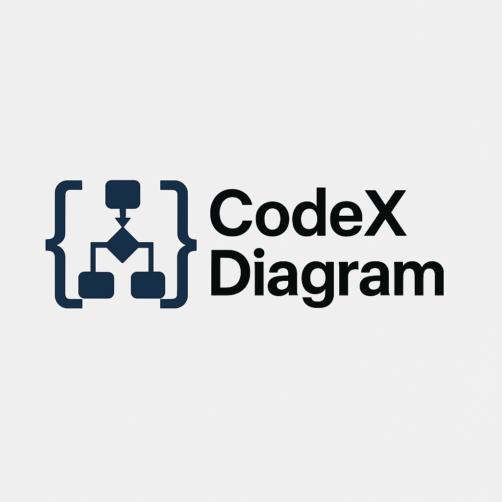
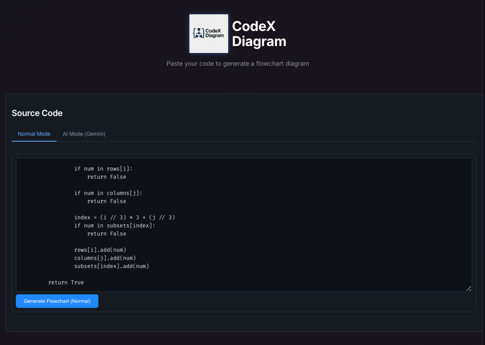
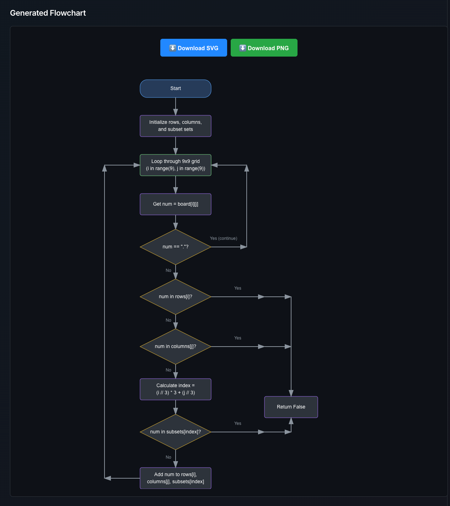
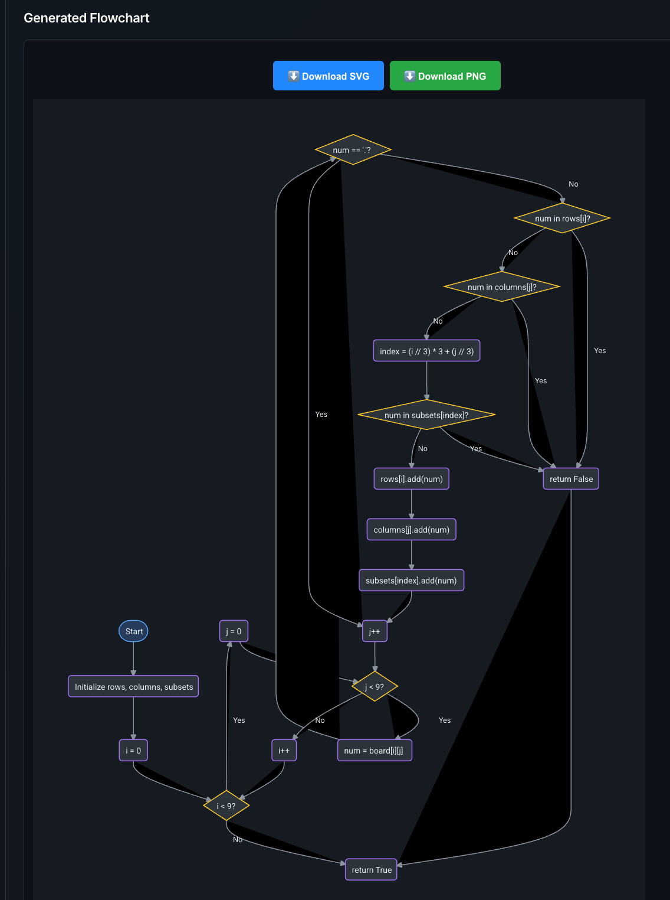

# CodeXDiagram

  

## Code to Flowchart Generator

CodeXDiagram is an intuitive web application that automatically generates visual flowcharts from your code. With both normal mode and AI-powered mode (using Gemini), it provides developers with a powerful tool to visualize algorithms and code logic.

Link: https://code-xdiagram.vercel.app/

  

## Features

- **Dual Generation Modes**:
  - **Normal Mode**: Quick and reliable standard flowchart generation
  - **AI Mode (Gemini)**: Advanced AI-powered analysis for more detailed and context-aware diagrams

- **User-Friendly Interface**:
  - Clean, modern dark theme inspired by GitHub
  - Intuitive code editor with syntax highlighting
  - Interactive flowchart visualization

- **Export Options**:
  - Download as SVG for scalable vector graphics
  - Download as PNG with optimized settings for dark background
  - Preserves white text for better visibility against dark backgrounds

- **Interactive Diagrams**:
  - Zoom controls for detailed inspection
  - Pan and navigate large diagrams

  
  

## Usage

1. **Input your code**:
   - Paste your code snippet into the editor
   - Select either Normal Mode or AI Mode (Gemini)

2. **Generate the flowchart**:
   - Click "Generate Flowchart" button
   - The flowchart will be rendered in the output section

3. **Export and share**:
   - Use the "Download SVG" button for vector graphics
   - Use the "Download PNG" button for raster images
   - Images have white text optimized for visibility against dark backgrounds

## Technologies Used

- **Frontend**:
  - React.js
  - D3.js for visualization
  - dagre-d3 for flowchart layout

- **Backend**:
  - Node.js
  - Express.js
  - Google Gemini API for AI-powered analysis
  - code2flow for flowchart generation in Normal mode
  - esprima and esgraph for code parsing and analysis

## Contribution

Contributions are welcome! Feel free to submit pull requests or open issues to improve the application.

## License

This project is licensed under the MIT License - see the [LICENSE](LICENSE) file for details.

---

  
  
Powered by <strong>CodeXDiagram</strong>

